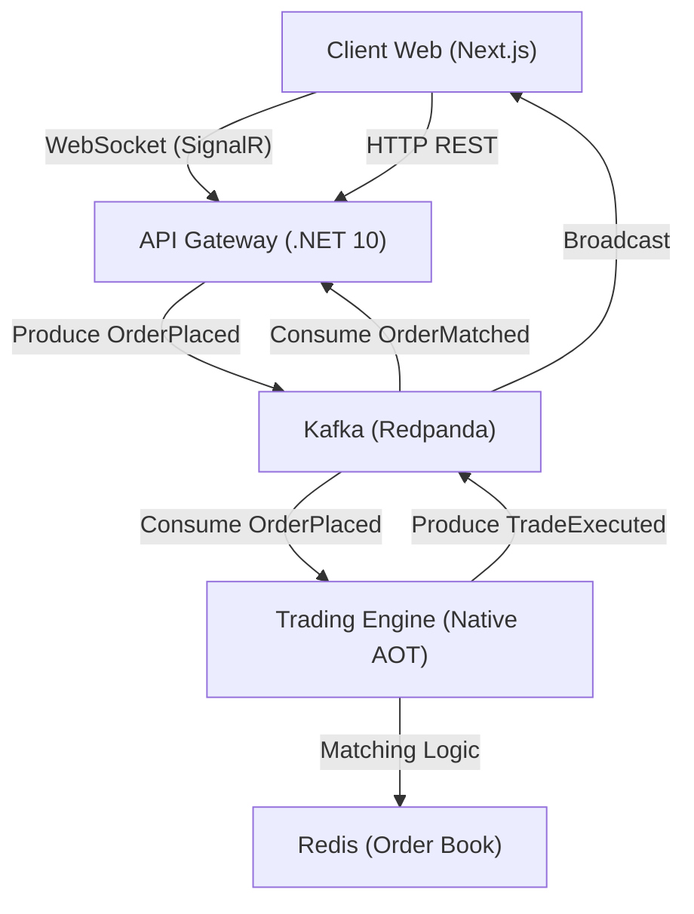

# Real-Time Trading Engine MVP 🚀

A high-performance codebase for a minimalist but functional real-time trading engine, demonstrating low-latency processing and modern distributed architecture using .NET 10 and Next.js.

## 🏗️ Architecture Overview



## ✨ Key Features

- **Order Book Implementation**: Efficient FIFO (First In First Out) matching algorithm using Redis Sorted Sets.
- **Native AOT Performance**: The Matching Engine is designed for compilation to Native code for maximum speed.
- **Real-Time Data Streaming**: SignalR bridge between Kafka events and the frontend dashboard.
- **Trading Dashboard**: Modern UI with live candle charts (Lightweight Charts), depth visualization, and instant order placement.
- **Event-Driven Architecture**: Fully decoupled services using Redpanda (Kafka) for robust event streaming.

## 🛠️ Technology Stack

- **Backend**: .NET 10, Minimal APIs, SignalR, Grpc.AspNetCore.
- **Frontend**: Next.js 14+, TypeScript, Vanilla CSS Modules.
- **Event Broker**: Redpanda (Kafka compatibility).
- **Storage**: Redis (Sorted Sets for price-time priority).
- **Infrastructure**: Docker & Docker Compose.

## 🚀 Getting Started

### 1. Prerequisites
- [.NET 9/10 SDK](https://dotnet.microsoft.com/download)
- [Node.js & npm](https://nodejs.org/)
- [Docker Desktop](https://www.docker.com/products/docker-desktop/)

### 2. Launch Infrastructure
Start the required services (Redis, Kafka):
```bash
docker-compose up -d
```

### 3. Start the Matching Engine
```bash
dotnet run --project TradingEngine.MatchingEngine
```

### 4. Start the API Gateway
```bash
dotnet run --project TradingEngine.Api
```

### 5. Launch the Frontend
```bash
cd trading-engine-web
npm install
npm run dev
```
Visit `http://localhost:3000` to see the engine in action.

## 📂 Project Structure

- `TradingEngine.Shared/`: Core models, result types, and shared interfaces.
- `TradingEngine.MatchingEngine/`: The low-latency engine responsible for FIFO logic.
- `TradingEngine.Api/`: The gateway service handling REST endpoints and WebSocket hubs.
- `trading-engine-web/`: The Next.js dashboard and trading interface.

## 📈 Performance Targets

| Metric | Target |
|--------|--------|
| Order Acceptance Latency | < 5ms |
| Matching Latency (p99) | < 2ms |
| Throughput | 1,000+ orders/sec |
| UI Update Latency | < 50ms |

## 💡 Future Roadmap
- [ ] Support for multiple trading pairs (ETH/USD, etc.).
- [ ] Advanced order types: Stop-Loss, Take-Profit, Iceberg.
- [ ] Wallet management and full transaction history.
- [ ] Persistent storage integration (PostgreSQL/TimescaleDB).
